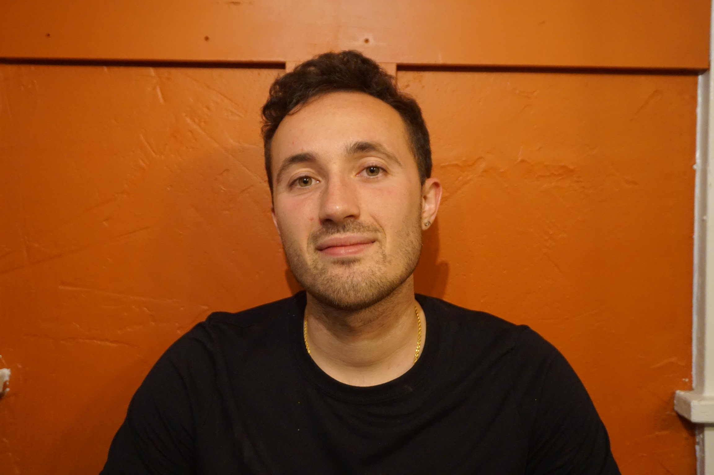

Welcome to personal site. I'm a mathematician, data science, and developer.

 

## About Me

Read about my experiences and interests in the [About Me](about/index.html) page.

You can find my current résumé and CV in the [Résumé and CV](cv/index.html) page.

Learn about my teaching in the [Teaching](teaching/index.html) page.

## Coding Projects

On this site I've highlighted some of my favorite coding projects. Read more about them in the [Projects](projects/index.html) page.
