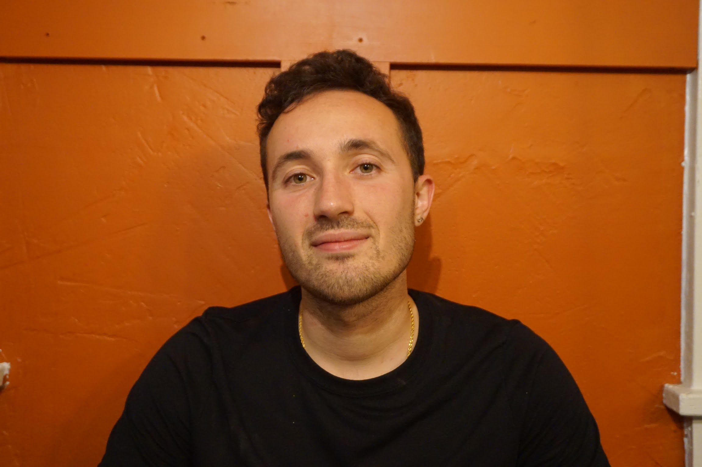

Welcome to my personal site. I am a mathematician, programmer, and explorer. I love to learn, ask questions, and build things.

 

## About Me

Read about my experiences and interests on the [About Me](about/index.html) page.

You can find my current résumé and CV on the [Résumé and CV](cv/index.html) page.

Learn about my teaching on the [Teaching](teaching/index.html) page.

Learn about my math on the [Math](math/index.html) page.

On this site I've highlighted some of my favorite coding projects. Read more about them in the [Projects](projects/index.html) page.

  <canvas id="logoRT" width="600" height="300"></canvas>

(This is an *epicycle* drawing)